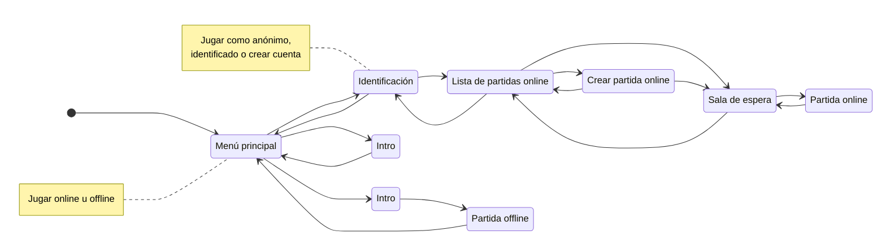

# README

Shooter colaborativo multijugador en línea ambientado en las profundidades del mar.

El repositorio está compuesto por dos proyectos:
* [Cliente](client): Juego hecho con Godot. Usa Rapier para las físicas deterministas y Netfox para la predicción y el rollback.
* [Servidor](server): Hecho con Node.js. Se comunica con los clientes a través de WebSocket y almacena la información en una base de datos SQLite.

## Argumento Idea Provisional

0. Presentacion de la historia: 

La madre pingüina de los jugadores se fue a cazar y volvió un tiempo indeterminado después cambiada (mala). Los jugadores la encierran, cogen su pistola y buscan una explicación.

1. Superficie 

- Escenario: Hielo, Glaciar, Montañas a lo lejos
- Enemigos:
  - Foca
  - Conejos
- Boss: Oso Polar
- Recompensas: Escafandra para sumergirse
- Final: entras en el agua por la entrada que el oso polar estaba tapando

2. Poca Profundidad

- Escenario: Agua poco profunda, cielo -> capa de hielo congelada.
- Enemigos: Foca, medusas, sardina, delfín
- Recompensas:
  - Linterna
  - Uzi: Dispara muy rapido pero tiene "poco" daño y poco cargador.
  - Fusil: Dispara "lento" pero hace más daño y poco cargador.
  - Arma Teledirigida: Poco daño pero siempre acierta.
- Final: Encuentras una cueva.

3. Cueva

- Escenario: Oscuro (ves todo oscuro), Cerrado, Tenebroso
- Boss: Kraken
- Recompensas:
  - Arpón: Es dificil de usar porque tienes que regoger el gancho pero hace mucho daño
  - Jetpack: Te da un dash - objeto especial (solo se puede tener uno equipado)
  - Escudo: Te protege del 90% del daño si pulsas *insertar aquí una letra* cuando te impacta el proyectil (parry) - objeto especial
- Final: Escapas del kraken al derrotarlo

4. Barco hundido

- Escenario: Barco hundido (habitaciones con objetos - barriles, mesas, sillas... flotando) 
- Enemigos: Lamprea, Sargo
- Boss: Tiburón Martillo, Pez Espada y Tiburón Blanco (3 boses pero + débiles)
- Recompensas:
 - Bazooka: proyectil lento pero explota (+ rango de daño)
 - Martillo de goma: mucho daño pero tienes que acercarte a los enemigos
- Final: Vas más profundo

5. Agua abisal

- Escenario: Oscuro (no ves las cosas lejos de ti) 
- Enemigos: Lamprea, pez linterna,
- Boss: Submarino
- Recompensas:
 - Minigun: puedes disparar y haces daño siempre y cuando estés quieto. Tarda en cargarse y se sobrecalienta. 
- Final: El submarino te da la llave para entrar en el laboratorio

6. Laboratorio

- Escenario: Instalaciones poco espaciosas, todo tecnificado
- Enemigos: Humanos en trajes de submarinista
- Boss: Humano en un robot gigante
- Final: Descubres lo que le pasó a tu madre (unos humanos le han puesto microchips en el cerebero y le controlaban, como el resto de peces en el océano) y tienes que hacer una elección.

7. Final

Depende de lo que elijas te saldrá una imagen con un texto explicando el final:

- Final humilde: decides salvar a tu madre, pero los peces vuelven a la normalidad y siguen matandose los unos a los otros.

- Final noble: decides controlar todos los peces en el mar y convertirte en líder supremo. Todo el mundo está bajo tu control.

## Modelos por hacer

- Foca
- Conejos
- Boss: Oso Polar
- Linterna
- Uzi: Dispara muy rapido pero tiene "poco" daño y poco cargador.
- Fusil: Dispara "lento" pero hace más daño y poco cargador.
- Arma Teledirigida: Poco daño pero siempre acierta.
- Boss: Kraken
- Escudo
- barriles, mesas, sillas...
- Lamprea
- Boss: Tiburón Martillo, Pez Espada y Tiburón Blanco
- Minigun
- Llave laboratorio
- Humanos en trajes de submarinista
- Boss: Humano en un robot gigante

## Git

Normas de estilo para los mensajes de los commits:

* Empezar con mayúscula.
* Estar escrito en modo imperativo (como si dieras una orden).
* No terminar con un punto.
* Claro y conciso. limitarse a un máximo de 50 caracteres.

Mensajes commit de ejemplo:

* Añade paginación a la lista de usuarios
* Corrige el error de validación en el formulario de contacto
* Evita la división por cero en el cálculo de estadísticas
* Resuelve el desbordamiento de texto en la barra lateral
* Impide que usuarios no autenticados vean la página de perfil
* Simplifica la lógica del script 'UserController'
* Extrae el componente 'Avatar' a un archivo independiente
* Renombra la variable 'usr' a 'usuario' para mayor claridad
* Actualiza el README con nuevas instrucciones de instalación
* Corrige erratas en la guía de contribución (CONTRIBUTING.md)
* Elimina el archivo 'user.gd' (ya no se usa)
* Modifica '.gitignore' para que ignore la carpeta '/dist'

## Diagrama de Flujo de Pantallas

